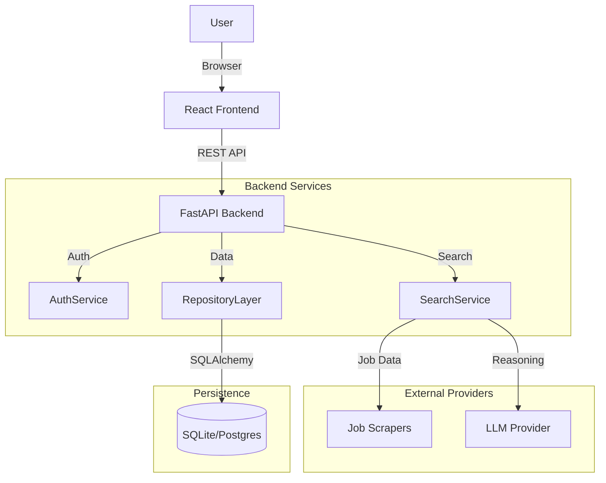

# Job Hunter AI 🚀

[](https://opensource.org/licenses/MIT)
[](https://www.python.org/downloads/)
[](https://reactjs.org/)
[](https://fastapi.tiangolo.com/)
[](https://vitejs.dev/)
[](https://github.com/psf/black)

**Job Hunter AI** is an advanced, self-hosted job search assistant designed to automate the repetitive and tedious aspects of finding a new job. By leveraging the power of Large Language Models (LLMs) and automated web scraping, it acts as a personal recruiter working 24/7 to find opportunities that match your specific profile.

Unlike standard job boards that rely on simple keyword matching, Job Hunter AI uses **semantic understanding** of your CV and career goals to identify relevant opportunities, even if the phrasing doesn't match exactly. It allows you to aggregate listings from multiple sources into a single, clean dashboard, score them based on fit, and track your application execution.

---

## 📑 Table of Contents

1. [Project Overview](#-project-overview)
2. [Key Features](#-key-features)
3. [Architecture & Design](#-architecture--design)
    - [System Overview](#system-overview)
    - [Backend Layering](#backend-layering)
    - [Frontend Structure](#frontend-structure)
    - [Data Flow](#data-flow)
4. [Technology Stack](#-technology-stack)
5. [Getting Started](#-getting-started)
    - [Prerequisites](#prerequisites)
    - [Installation](#installation)
    - [Database Setup](#database-setup)
6. [Configuration Guide](#-configuration-guide)
    - [Environment Variables](#environment-variables)
    - [LLM Provider Setup](#llm-provider-setup)
7. [Usage Guide](#-usage-guide)
    - [User Registration](#1-user-registration)
    - [Creating a Search Profile](#2-creating-a-search-profile)
    - [Running a Search](#3-running-a-search)
    - [Interpreting Results](#4-interpreting-results)
    - [Scheduling](#5-scheduling)
8. [API Documentation](#-api-documentation)
9. [Development Guide](#-development-guide)
    - [Project Structure](#project-structure)
    - [Running Tests](#running-tests)
10. [Troubleshooting](#-troubleshooting)
11. [License](#-license)

---

## 🌟 Project Overview

Finding a job is a full-time job. You have to check multiple sites, filter through hundreds of irrelevant listings, and tailor your CV for every application. **Job Hunter AI** solves this by:

1. **Reading your CV**: It understands your skills, seniority, and preferences.
2. **Scraping the Web**: It connects to job boards (starting with Swiss market leader `job-room.ch`) to fetch raw listings.
3. **Applying AI Logic**: It uses LLMs to "read" every job description and score it against your profile.
4. **Automating the Hunt**: It can run on a schedule, alerting you only when high-quality matches are found.

This project is designed to be **self-hosted**, ensuring your data (CV, search preferences) stays private on your own machine.

---

## ✨ Key Features

### 🔍 AI-Powered Discovery

- **Smart Keyword Extraction**: Analyzes your uploaded CV (PDF/Text) to extract relevant technical skills, soft skills, and domain expertise.
- **Semantic Matching**: Uses LLMs to understand the *intent* of a job posting, not just keyword frequency.
- **Customizable Strategy**: You can instruct the AI (e.g., "Focus on startups," "Avoid heavy legacy java roles") to refine its filtering criteria.

### 🤖 Intelligent Analysis

- **Scoring Engine**: Every found job is scored from 0-100% based on your profile compatibility.
- **Summary Generation**: The AI generates a concise reason *why* a job is a good or bad fit (e.g., "Strong match for Python skills, but requires 5 years experience where you have 3").
- **Multi-Provider Support**: Seamlessly switch between different AI brains:
  - **Groq** (Llama 3, Mixtral) - Ultra-fast inference.
  - **DeepSeek** - Cost-effective coding specialist.
  - **Google Gemini** - High context window and reasoning capabilities.
  - **Ollama** (Local) - Run privacy-focused models like Llama 3 locally.

### 🇨🇭 Optimized for the Swiss Market

- **JobRoom Integration**: Built-in scraper for `job-room.ch` (RAV/Unemployment office database).
- **Language Support**: Capable of processing job descriptions in German, French, Italian, and English.
- **Location Filtering**: Precise radius-based filtering (e.g., "Within 50km of Zurich").

### ⚡ Automation & Workflow

- **Background Scheduling**: Set up cron-like schedules to run searches every X hours automatically.
- **Real-Time Progress**: Watch the agent generate queries, scrape sites, and analyze jobs live.
- **Application Tracking**: Mark jobs as "Applied" to keep track of your progress.
- **Duplicate Detection**: Intelligent hashing prevents seeing the same job twice, even if reposted.

### 📊 Modern User Interface

- **Glassmorphism Design**: Premium, translucent UI with interactive gradients and animations.
- **Responsive Layout**: Optimized 2-column forms and card-based results.
- **Dark Mode**: Easy on the eyes for late-night job hunting sessions.
- **Smart Filters**: Filter jobs by Match Score, Distance, or "Worth Applying" status directly on the dashboard.

---

## 🏗 Architecture & Design

Job Hunter AI follows a **Clean Architecture** approach to ensure maintainability, testability, and independence from external frameworks.

### System Overview



### Backend Layering

The backend corresponds to `backend/` in the source tree and is divided into strict layers:

1. **API Layer (`backend/api`)**:
    - **Responsibility**: Handles HTTP requests, input validation (Pydantic), and response formatting.
    - **Characteristics**: Thin, contains no business logic. Delegates immediately to Services.
    - **Endpoints**: `/auth`, `/jobs`, `/search`, `/profiles`.

2. **Service Layer (`backend/services`)**:
    - **Responsibility**: Core business logic. Orchestrates interactions between Repositories and Providers.
    - **Examples**: `SearchService` (manages generic search flow), `AuthService` (handles JWT issuance).
    - **Key Logic**: "Get keywords from LLM -> Run Scrapers -> Filter Results -> Save to DB".

3. **Repository Layer (`backend/repositories`)**:
    - **Responsibility**: Abstract data access. Provides clean interfaces (`get`, `create`, `update`, `delete`) to the database.
    - **Pattern**: Repository Pattern.
    - **Benefit**: Decouples business logic from specific ORM (SQLAlchemy) calls, making testing easier via mocking.

4. **Provider Layer (`backend/providers`)**:
    - **Responsibility**: Interfaces with external worlds.
    - **Details**:
        - `llm/`: Adapters for OpenAI, Gemini, Groq, Deepseek.
        - `jobs/`: Adapters for JobRoom.
    - **Pattern**: Adapter/Strategy Pattern.

### Frontend Structure

The frontend is a Single Page Application (SPA) built with Vite + React.

- **Components**: Reusable UI elements (`JobTable`, `SearchForm`, `SearchProgress`).
- **Services**: API client wrappers that mirror the backend controllers.
- **State**: Local state management with React Hooks (`useState`, `useEffect`).
- **Routing**: Simple view-based routing for Dashboard, Search, and Schedules.

---

## 💻 Technology Stack

### Backend

- **Language**: Python 3.10+
- **Framework**: FastAPI (High performance async framework)
- **ORM**: SQLAlchemy (Database abstraction)
- **Validation**: Pydantic v2 (Data validation settings)
- **Authentication**: OAuth2 with JWT (JSON Web Tokens)
- **HTTP Client**: Httpx (Async HTTP requests)
- **Testing**: Pytest, Pytest-Asyncio
- **Task Queue**: BackgroundTasks (Simple in-memory queue)

### Frontend

- **Framework**: React 19
- **Build Tool**: Vite (Next generation frontend tooling)
- **Styling**: Bootstrap 5 (CSS Framework), Bootstrap Icons
- **Language**: JavaScript (ES6+)
- **HTTP Client**: Fetch API (wrapped in custom client)

### DevOps & Tools

- **Database**: SQLite (default), extensible to PostgreSQL
- **Linting**: ESLint (Frontend), Ruff (Backend - recommended)
- **Version Control**: Git

---

## 🚀 Getting Started

Follow these instructions to get a copy of the project up and running on your local machine.

### Prerequisites

Ensure you have the following installed:

- **Python 3.10** or higher: [Download Python](https://www.python.org/downloads/)
- **Node.js 18** or higher (LTS recommended): [Download Node.js](https://nodejs.org/)
- **Git**: [Download Git](https://git-scm.com/)
- **API Key**: You need an API key for Groq, DeepSeek, or Gemini (unless using Ollama).

### Installation

#### 1. Clone the Repository

```bash
git clone https://github.com/ejupi-djenis30/job-hunter-ai.git
cd job-hunter-ai
```

#### 2. Backend Setup

It is recommended to use a virtual environment to manage Python dependencies.

**Windows:**

```powershell
python -m venv venv
.\venv\Scripts\activate
```

**macOS/Linux:**

```bash
python3 -m venv venv
source venv/bin/activate
```

Install the required packages:

```bash
pip install -r requirements.txt
```

#### 3. Frontend Setup

Navigate to the frontend directory and install dependencies:

```bash
cd frontend
npm install
```

### Database Setup

By default, the application uses **SQLite**, which requires no additional installation. The database file `job_hunter.db` will be automatically created in the root directory upon the first run of the application.

If you wish to use PostgreSQL:

1. Install PostgreSQL and create a database (e.g., `jobhunter`).
2. Install the driver: `pip install psycopg2-binary`.
3. Update the `DATABASE_URL` in `.env`.

---

## ⚙ Configuration Guide

The application is configured using environment variables. This serves as the single source of truth for configuration.

1. **Create the Environment File**:

    ```bash
    cp .env.example .env
    ```

    *(On Windows, ensure you copy the contents manually if `cp` is not available, or use `copy .env.example .env`)*

2. **Edit `.env`**: Open the file in your text editor and fill in your secrets.

### Environment Variables

Here is a detailed explanation of every available configuration option:

| Variable | Required | Default | Description |
| :--- | :---: | :--- | :--- |
| **General** | | | |
| `PROJECT_NAME` | No | Job Hunter AI | Name of the application displayed in Swagger UI. |
| `API_V1_STR` | No | /api/v1 | Prefix for all API endpoints. |
| `LOG_LEVEL` | No | INFO | Logging verbosity (`DEBUG`, `INFO`, `WARNING`, `ERROR`). |
| **Security** | | | |
| `SECRET_KEY` | **Yes** | *changeme* | Random string used to sign JWT tokens. **CRITICAL**: Use a strong random string (e.g., `openssl rand -hex 32`). |
| `ACCESS_TOKEN_EXPIRE_MINUTES` | No | 11520 | Token validity in minutes (11520 = 8 days). |
| `CORS_ORIGINS` | No | `http://localhost:5173,http://localhost:8000` | Comma-separated list of allowed origins. **Must match your frontend URL.** |
| **Database** | | | |
| `DATABASE_URL` | No | `sqlite:///./job_hunter.db` | Connection string. |
| **LLM Configuration** | | | |
| `LLM_PROVIDER` | **Yes** | `groq` | Which AI provider to use. Options: `groq`, `deepseek`, `gemini`.|
| `LLM_API_KEY` | **Yes** | - | The specific API key for the chosen provider. |
| `LLM_MODEL` | No | *Provider Default* | Override the specific model name (e.g., `llama3-70b-8192` for Groq). |
| **Scraping** | | | |
| `JOBROOM_USER_AGENT` | No | *Generic User Agent* | User Agent string used for scraping requests. |

### LLM Provider Setup

#### Groq (Recommended for Speed)

- **Sign up**: [console.groq.com](https://console.groq.com)
- **Variable**: `LLM_PROVIDER=groq`
- **Model**: `llama3-70b-8192` (extremely fast)

#### DeepSeek (Recommended for Reasoning/Coding)

- **Sign up**: [deepseek.com](https://platform.deepseek.com)
- **Variable**: `LLM_PROVIDER=deepseek`
- **Model**: `deepseek-chat` or `deepseek-reasoner`

#### Google Gemini (High Context)

- **Sign up**: [aistudio.google.com](https://aistudio.google.com/)
- **Variable**: `LLM_PROVIDER=gemini`
- **Model**: `gemini-1.5-flash`

---

## 📖 Usage Guide

### 1. Starting the Application

You need two terminal windows running simultaneously.

**Terminal 1 (Backend):**

```bash
# Ensure venv is active
uvicorn backend.main:app --reload
```

*Backend starts at `http://localhost:8000`*

**Terminal 2 (Frontend):**

```bash
cd frontend
npm run dev
```

*Frontend starts at `http://localhost:5173`*

### 2. User Registration

1. Open `http://localhost:5173`.
2. Click "Don't have an account? Register".
3. Enter a username and password (min 4 chars).
4. Click "Create Account" to log in automatically.

### 3. Creating a Search Profile

The Search Profile is the heart of the application. It tells the AI what to look for.

1. Click **New Search** (nav bar).
2. **Role Description**: Be specific.
   - *Example: "Senior Backend Developer in Fintech, prefer Python/FastAPI, remote or Zurich."*
3. **Upload CV (Required)**:
   - The AI reads your CV (PDF/Text) to find skills you might have missed (e.g., "PostgreSQL", "Docker").
4. **Filters**:
   - Location (e.g., "Bern"), Workload, Scrape Speed (Sequential vs Immediate).
5. **AI Strategy**:
   - Add custom instructions like "Ignore consultancies" or "Prioritize startups".

### 4. Running a Search

Click **Start Job Search**. You will see the **Search Progress** screen:

1. **Generating Queries**: AI converts your profile into search terms (e.g., "Python Developer Zurich").
2. **Searching**: Scrapers fetch jobs from enabled providers.
3. **Analyzing**: The AI reads every job description and scores it (0-100%).
4. **Complete**: Results are saved.

### 5. Interpreting Results

Go to the **Job Board** (home screen).

- **Match Score**:
  - 🟢 **>75%**: Strong match.
  - 🟡 **50-75%**: Potential match.
  - 🔴 **<50%**: Low relevance.
- **"Worth Applying" Badge**: 💡 The AI found a specific reason this job is good, even if the score is lower.
- **Actions**:
  - **Apply**: Opens the job link.
  - **Checkmark**: Marks as applied/tracking.

### 6. Scheduling

Automate your job hunt!

- In **New Search**, enable **Auto-Repeat Search**.
- Choose an interval (e.g., "Every 24 hours").
- The backend will run the search in the background (as long as the server is running).
- View active schedules in the **Schedules** tab.

---

## 📡 API Documentation

The backend provides interactive documentation via Swagger UI.

- **Swagger UI**: `http://localhost:8000/docs`
- **ReDoc**: `http://localhost:8000/redoc`
- **OpenAPI Spec**: `http://localhost:8000/api/v1/openapi.json`

Common Endpoints:

- `POST /api/v1/auth/login`: Get JWT token.
- `GET /api/v1/jobs/`: List analyzed jobs.
- `POST /api/v1/search/start`: Trigger a new search based on profile to run in background.
- `GET /api/v1/search/status/{id}`: Poll search progress.

---

## 💻 Development Guide

### Project Structure

```text
job-hunter-ai/
├── backend/                  # Python Backend
│   ├── api/                  # API Routers (auth, jobs, search)
│   ├── core/                 # Config & Exceptions
│   ├── db/                   # Database Session & Base
│   ├── providers/            # External Adapter Layer
│   │   ├── llm/              # LLM Implementations
│   │   └── jobs/             # Job Board Scrapers
│   ├── repositories/         # DB Access Layer
│   ├── services/             # Business Logic (Search, Auth)
│   ├── schemas.py            # Pydantic Models
│   ├── models.py             # SQLAlchemy Models
│   └── main.py               # Application Entry
├── frontend/                 # React Frontend
│   ├── src/
│   │   ├── components/       # UI Components
│   │   ├── services/         # API Clients
│   │   └── App.jsx           # Main Router
├── tests/                    # Pytest Suite
│   ├── unit/                 # Unit Tests (Mocked)
│   └── integration/          # API Integration Tests
└── requirements.txt          # Python Dependencies
```

### Running Tests

We use `pytest` for robust testing.

```bash
# Run all tests
pytest

# Run with verbose output
pytest -v

# Run specific test file
pytest tests/unit/test_auth.py
```

**Test Coverage**:

- **Unit Tests**: Mocked dependencies to test Services/Repositories.
- **Integration Tests**: Full API flow tests using an in-memory SQLite database.

---

## ❓ Troubleshooting

### Common Issues

#### 1. "Connecting to search agent..." hangs forever

**Cause**: The frontend cannot reach the backend, often due to CORS.
**Fix**:

- Ensure `CORS_ORIGINS` in `.env` includes your frontend URL (e.g., `http://localhost:5173`).
- Restart the backend after changing `.env`.

#### 2. "Validation Error" on login

**Cause**: Incorrect username/password format or database usage.
**Fix**: Ensure password is at least 4 characters. If database is corrupted, delete `job_hunter.db` to reset.

#### 3. LLM API Errors

**Cause**: Invalid API key or Rate Limiting.
**Fix**: Check `LLM_API_KEY` in `.env`. Switch to a different provider if rate limited.

---

## 📄 License

This project is licensed under the MIT License - see the [LICENSE](LICENSE) file for details.
